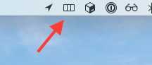

# QuickMouse

An accessibility tool to control the mouse with your keyboard.

[comment]: <> ()

## How to use QuickMouse

Once you've opened `QuickMouse.app` and got it running, you should see the QuickMouse icon in your Menu Bar:

Once the application is running, double-tap the hotkey to trigger QuickMouse's interface to show.

By default, the hotkey is the `Control` button. Pressing it twice within one third of a second should be fast enough.

[Click here to learn where the Control key is on a Mac keyboard.](https://www.quora.com/Where-is-the-control-key-on-a-Mac/answer/Trevor-Zylstra-1)

